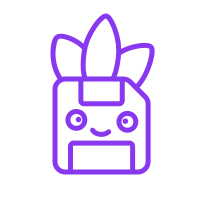
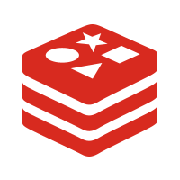

  
  <h1>口袋点餐</h1>

## 项目简介

口袋点餐，是一个店内扫码点餐系统，能实现同桌实时点餐同步，上菜进 度实时跟踪，菜品管理和菜品分类管理等功能。

## 项目技术栈

### 前端

使用 Vue3开发，集成了 AxiosHTTP请求工具，使用 Pinia进行状态 管理，通过 PiniaPersistedstate实现状态持久化， VueRouter4管理路由， cryptojs加密密码。

### 后端

使用 SpringBoot3构建 RESTful API，整合 MybatisPlus做数据库交互， 使用 Redis实现数据缓存， AliOSSSDK进行阿里云对象存储URL签名。使用 security crypt库对密码进行加密，使用 JJWT生成和验证token。

